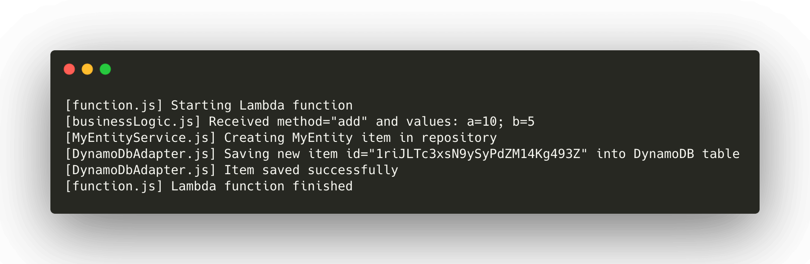

# serverless-logger
Simple logger for AWS Lambda functions that has two cool features:
* display filename as a prefix in each log message
* hide log messages when running tests but keep log messages when used in Lambda.

## How to use?
Install it using `npm`:
```
npm i serverless-logger
```
Initialize it like that. Don't forget about `(__filename)`.
```JavaScript
const log = require('serverless-logger')(__filename)
```
Next you can use the `log` function in your code in the same way as ordinary `console.log()`. Similarly, it takes one or more parameters.

For example you could use it in a Lambda function like that:
```JavaScript
const log = require('serverless-logger')(__filename)

const handler = async (event) => {
  log('Starting Lambda function')
  /*   do your thing here  */
  log('Lambda function finished')
}

module.exports.handler = handler
```

Your log messages (which are stored in Cloudwatch) will include name of the file from which they originate. For example, given that your code is divided to several files:

Underneath it uses regular `console.log()` and was tested with `jest`.
## DEBUG mode
If you want to see logs when running tests on your local machines just set environment variable `DEBUG` to value `ON`. For example:
```
DEBUG=ON npm run test
```
# Why use it?
This approach streamlines debugging and makes it easier to figure out how the code works.

At the same time when running tests locally logs don't clutter our console.


# Why no levels?
Usually there are different levels of logs i.e `debug`, `info`, `warn`, `error`. They make sense in huge code projects. 

However, after years of working with Lambda I found that for most projects that *don't handle huge volumes* of transactions they are pure *overkill*.

In order to constrain CloudWatch costs I prefer to set log retention period for several weeks instead of dealing with different log levels. This approach also makes code easier to read.